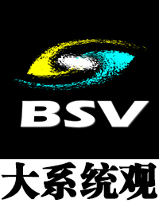
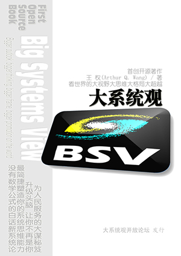
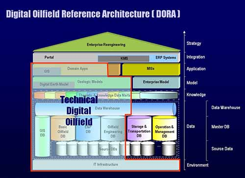

#### [中文🔃](#english)
# About Me
## Arthur Q. W. (ArthurTreeNewBee): a Thinker Keeping Coding
### ☑️ As the Founder of Thought of [Big Systems View]
<table border="10">
  <tr>
    <td>
       
        Proposed a pioneering thought, the idea of Big Systems View (BSV), based on traditional systems theory and systems engineering thinking, and combined with own long-term and rich experience in IT & Other systems construction.  
        BSV mainly includes System Structure Dynamics, Holographic Organic System Theory, BSV Philosophy and relevant methodologies, which are applied in the domain of Digital/Intelligent Oilfields and AI development applications.  
    </td>
    <td></td>
  </tr>
    <tr>
    <td colspan="2">
    Official Website of [Big Systems View]: http://www.holomind.com.cn
    
    </td>
  </tr>
</table>
 

### ☑️ As the Author of [_Big Systems View_]
<table border="10">
  <tr>
    <td>
       In 2016, completed the open source book: 
      &nbsp;&nbsp;&nbsp;&nbsp;&nbsp;&nbsp;&nbsp;&nbsp;Big Systems View: Bigger outlook, bigger thinking, bigger frame, bigger promotion on the world  
      The book rejects the traditional publishing mode, and adopts the form of directly publishing the electronic version on the Internet and inviting everyone to co_compile it, setting a precedent for free and open source electronic books.   
      The book immediately caused a significant response in the relevant fields after its release.
    </td>
    <td></td>
  </tr>
  <tr>
    <td colspan="2">
      Based on the version 1.0 of the original book, various materials (PPT courseware, videos, blogs, articles, etc.) with more complete ideas and richer contents have been formed through continuous iteration. All materials and the original book can be retrieved and downloaded on the Internet, or go to the official website of the [Big Systems View]: http://www.holomind.com.cn .
        
    </td>
  </tr>
</table>
 

### ☑️ As the Proposer / Doer of Concept of [Digital Oilfield]
<table border="10">
  <tr>
    <td>
     
    In 1999, proposed the concept of Digital Oilfield at first globally.  
    Published numerous academic papers such as "The Research on the Modes and the Developing Strategies of Digital Oilfield of Daqing Oilfield Co., Ltd."  over the past years, leading the trend of Digital/Intelligent Oilfield research and construction in China.  
    Simultaneously, exert all my strength to push the practices of Digital Oilfields construction forward.  
    </td>
    <td></td>
  </tr>
  <tr>
    <td colspan="2">
      Integrating knowledge with action, forming a profound theoretical foundation, and accumulating rich practical experience, proposed powerful methodologies for digital construction in large-scale enterprises  based on the philosophy of Big Systems View.  
      In 2003, independently developed, hosted, and operated the [Digital Oilfield Forum] website, providing a communication platform for experts, scholars, entrepreneurs, engineers, managers, and service providers in the global DOF Domain, and having a significant influence in the industry.  
In 2013, jointly established the [Open Forum for Intelligent Digital Oilfields], which adopts an integrated online and offline approach to conduct research, application, communication, and cooperation on digital/smart/intelligent oilfield construction, striving to promote the development of construction of IDOF.  
      
        
    </td>
  </tr>
</table>
 

### ☑️ As the Inventor and Software Author of AHMM
<table border="10">
  <tr>
    <td>
     
    In 2022, invented a new kind of mind map called Arthur's Holographic Mind Map (AHMM) based on the principles of Big Systems View, and developed specialized software using JavaScript. It is still being continuously updated to this day.  
    </td>
    <td></td>
  </tr>
  <tr>
    <td colspan="2">
    AHMM is used for system thinking with higher dimensions. Everything in the world is a system with a core, attractor @. AHMM observes the world from a systematic perspective, focusing on the structural information of the system, holography, and capturing the essence of things, then discovering patterns through appearances and data.  
Software ahmm.html can be used online or downloaded for offline use.
It has some magical characteristics of a holographic organic system: data and execution code are integrated, it can save data for itself, and can infinitely run and reproduce, that is, the generated AHMM can continue to generate the next generation.
        
To Use Online: http://www.holomind.com.cn/ahmm/ahmm.html  
To Download and Use Offline: http://www.holomind.com.cn/ahmm/downloads/ahmm阿色全息脑图H2024_9_19_12.zip  
    </td>
  </tr>
</table>
 

### ☑️ As an Old Programmer Keeping Coding / Coder Keeping Thinking
<table border="10">
  <tr>
    <td>
     
    Love programming, and switched from geophysical exploration to programming in the VMS/DOS/Unix era.   
    Used various languages including FORTRAN, SQL, BASIC, C, HTML, ASP, JS, ..., and even Python, but now just for preventing myself from dementia in old age by coding.   
    </td>
    <td></td>
  </tr>
  <tr>
    <td colspan="2">
    Hosted and participated in various levels of informationization and digitization projects, including GJ Major Special Project ** Intelligent *** (sub project), Distributed Large Cloud Data Center, Intelligent Command Centers of some super large enterprises, Internet of Things Industry Base, * * * Integrated Collaborative Research Platform, ERP, GIS/Beidou application, UAV, and so on.  
      Love thinking, love philosophy, love communication, love to implement ideas with code, and love to help young programmers solve cross-layer and cross-border problems.  
      Ever studied and worked abroad for a long time, understood Western thinking, was good at combining Chinese and Western thought and culture, and had strong systematic thinking ability.  
      My slogan is: Learn from Young People!
        
    </td>
  </tr>
</table>

### Welcome to Web Site / WeChat Official Account of BSV
http://www.holomind.com.cn  

  
 

#### [English🔃](#中文)
# 自我介绍
## 阿色树新风: 坚持编程的思想者
### ☑️ [大系统观]创立者
<table border="10">
  <tr>
    <td>
       
    基于传统的系统论和系统工程思想，结合自身长期、丰富的信息化、数智化建设和其他专业领域工作经验，开创性地提出了全新的大系统观思想。  
    大系统观思想主要包括系统结构动力学、全息有机系统论、大系统哲学和方法论，在其应用于数字/智能油田、大型企业与组织数智化建设和AI开发领域的过程中，显示出了重要指导作用。  
    </td>
    <td></td>
  </tr>
  <tr>
    <td colspan="2">
    【大系统观】官网：http://www.holomind.com.cn
        
    </td>
  </tr>
</table>
 

### ☑️ 《大系统观》作者
<table border="10">
  <tr>
    <td>
        2016年完成了开源著作： 
      &nbsp;&nbsp;&nbsp;&nbsp;《大系统观：看世界的大视野大思维大格局大超越》  
      该书拒绝传统出版模式，采用在互联网上直接发布电子版并邀请大家共同编著的形式，开辟了免费开源电子著作的先例。   
      该书发布后立即在相关领域内引起较大反响。
    </td>
    <td></td>
  </tr>
  <tr>
    <td colspan="2">
      在原书1.0版本基础上，通过不断迭代，形成了思想更加完备、内容更加丰富的各种资料（PPT课件、视频、公众号、文章等）。所有资料以及原书均可在互联网上检索并下载，或者，到【大系统观】官网：http://www.holomind.com.cn 下载。
        
    </td>
  </tr>
</table>
 

### ☑️ [数字油田]概念提出者 / 践行者
<table border="10">
  <tr>
    <td>
     
    1999年，在全球范围内最先提出数字油田(Digital Oilfield)理念。  
    多年来陆续发表《大庆油田有限责任公司数字油田模式与发展战略研究》等大量学术论文，引领中国数字/智能油田研究与建设浪潮。  
    </td>
    <td></td>
  </tr>
  <tr>
    <td colspan="2">
      同时，全心投身到数智油田建设实践洪流之中，知行合一，形成了深厚的理论积淀，积累了丰富的实践经验，提出了以大系统观为思想基座的大型企业数智化建设方法论。   
      2003年，独立开发并主持运营【数字油田论坛】网站，为全球数字油田建设的专家、学者、企业家、工程师、管理人员以及服务商提供了交流平台，在业界具有较大影响力。  
      2013年，联合创立【智能数字油田开放论坛】，采用线上线下一体化的方式，开展油田数智化建设的研究、应用、交流与合作，努力推动数智油田建设发展。  
      
        
    </td>
  </tr>
</table>
 

### ☑️ 阿色全息脑图（AHMM）发明者和软件作者
<table border="10">
  <tr>
    <td>
     
    2022年，应用大系统观思想原理，发明了一种新的思维导图——阿色全息脑图（AHMM, Arthur's Holographic Mind Map），并用 JavaScript 开发了专用软件，至今仍在持续更新。  
    </td>
    <td></td>
  </tr>
  <tr>
    <td colspan="2">
    AHMM 用于系统升维思考。世间每项事物都是一个系统，都有一个核心 —— 吸引子@。全息脑图以系统的观点看待世界，专注系统的结构信息——全息，抓住事物的本质，透过表象和数据发现规律。  
    阿色全息脑图制作软件 ahmm.html，可在线使用，也可下载后离线使用。它具有神奇的全息有机系统的特点：数据与执行码一体化，能自己给自己保存数据，并能够无限运行繁衍，即生成的脑图可以继续生成下一代脑图。
      
    在线使用：http://www.holomind.com.cn/ahmm/ahmm.html  
    下载后离线使用：http://www.holomind.com.cn/ahmm/downloads/ahmm阿色全息脑图H2024_9_19_12.zip  
    </td>
  </tr>
</table>
 

### ☑️ 坚持编程/思考的老程序猿
<table border="10">
  <tr>
    <td>
     
    酷爱编程，VMS/DOS/Unix时代从地球物理勘探专业转行入坑的老程序员，从FORTRAN、SQL、BASIC、C、HTML、ASP、JS、……，一直到现在的Python，都玩过。  
    但现在只是玩，主要是为了防止老年痴呆。  
    </td>
    <td></td>
  </tr>
  <tr>
    <td colspan="2">
   主持参与过各级各种大中小型信息化数智化研究与应用项目，包括GJ重大专项***智能化子课题、分布式大型云数据中心、超级央企智慧指挥中心、物联网产业基地、***一体化协同研究平台、ERP、GIS/北斗**应用系统、无人机……  
      爱思考，爱哲学，爱交流，爱把想法用代码实现，最爱帮助小程序猿们解决跨层跨界的问题。  
      年轻时曾较长期在发达国家学习工作，理解西方思维，擅长中西合璧，具有较强系统思维能力。  
      我的口号是：向年轻人学习！
        
    </td>
  </tr>
</table>

### 欢迎访问大系统观官网 / 微信公众号
http://www.holomind.com.cn  

